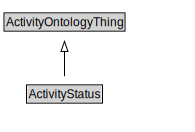

# ActivityStatus

<a href="../../diagrams/Activity__ActivityStatus.dot.svg">Open interactive ActivityStatus diagram</a>

## Formalization for ActivityStatus

| Property | Constraint |
|----------|------------|
| subClassOf | ActivityOntologyThing |

