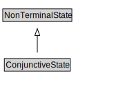

# ConjunctiveState

<a href="../../diagrams/Activity__ConjunctiveState.dot.svg">Open interactive ConjunctiveState diagram</a>

## Formalization for ConjunctiveState

| Property | Constraint |
|----------|------------|
| disjointWith | DisjunctiveState |
| subClassOf | NonTerminalState |

