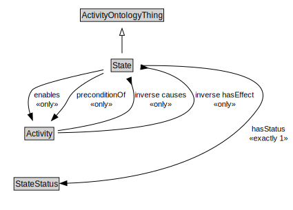

# State

<a href="../../diagrams/Activity__State.dot.svg">Open interactive State diagram</a>

## Specializations of State

| Class | Description |
|-------|-------------|
| [Conjunctive State (Activity)](Activity__ConjunctiveState.md) |  |
| [Disjunctive State (Activity)](Activity__DisjunctiveState.md) |  |
| [Manifestation State (Activity)](Activity__ManifestationState.md) |  |
| [Non Terminal State (Activity)](Activity__NonTerminalState.md) |  |
| [Terminal State (Activity)](Activity__TerminalState.md) |  |

## Formalization for State

| Property | Constraint |
|----------|------------|
| enables | all Activity |
| hasStatus | exactly 1 owl::Thing |
| inverse causes | all Activity |
| inverse hasEffect | all Activity |
| preconditionOf | all Activity |
| subClassOf | ActivityOntologyThing |

## Used by classes

| Class | Property |
|-------|----------|
| [Activity (Activity)](Activity__Activity.md) | causes |
| [Activity (Activity)](Activity__Activity.md) | enabledBy |
| [Activity (Activity)](Activity__Activity.md) | hasEffect |
| [Activity (Activity)](Activity__Activity.md) | hasPrecondition |
| [Non Terminal State (Activity)](Activity__NonTerminalState.md) | hasSubstate |

