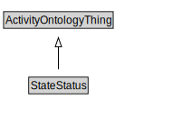

# StateStatus

<a href="../../diagrams/Activity__StateStatus.dot.svg">Open interactive StateStatus diagram</a>

## Formalization for StateStatus

| Property | Constraint |
|----------|------------|
| subClassOf | ActivityOntologyThing |

