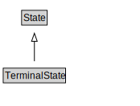

# TerminalState

<a href="../../diagrams/Activity__TerminalState.dot.svg">Open interactive TerminalState diagram</a>

## Specializations of TerminalState

| Class | Description |
|-------|-------------|
| [Manifestation State (Activity)](Activity__ManifestationState.md) |  |

## Formalization for TerminalState

| Property | Constraint |
|----------|------------|
| subClassOf | State |

