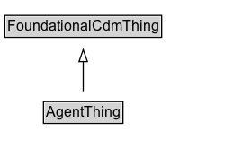

# AgentThing

Added for organizational purposes, to identify all classes defined in the Agent pattern.

## Diagram

=== "SVG (interactive)"

    <!-- Generated by graphviz version 14.1.3 (20260303.0454)
     -->
    <!-- Pages: 1 -->
    <svg width="194pt" height="132pt"
     viewBox="0.00 0.00 194.00 132.00" xmlns="http://www.w3.org/2000/svg" xmlns:xlink="http://www.w3.org/1999/xlink">
    <g id="graph0" class="graph" transform="scale(1 1) rotate(0) translate(4 128)">
    <polygon fill="white" stroke="none" points="-4,4 -4,-128 190.38,-128 190.38,4 -4,4"/>
    <g id="clust3" class="cluster">
    <title>cluster_associated</title>
    </g>
    <!-- FoundationalCdmThing -->
    <g id="node1" class="node">
    <title>FoundationalCdmThing</title>
    <g id="a_node1"><a xlink:href="../FoundationalCdmThing" xlink:title="&lt;TABLE&gt;">
    <polygon fill="lightgray" stroke="none" points="1,-97.88 1,-114.12 129.75,-114.12 129.75,-97.88 1,-97.88"/>
    <text xml:space="preserve" text-anchor="start" x="2" y="-101.88" font-family="Arial" font-size="12.00">FoundationalCdmThing</text>
    <polygon fill="none" stroke="black" points="0,-96.88 0,-115.12 130.75,-115.12 130.75,-96.88 0,-96.88"/>
    </a>
    </g>
    </g>
    <!-- AgentThing -->
    <g id="node2" class="node">
    <title>AgentThing</title>
    <g id="a_node2"><a xlink:href="../AgentThing" xlink:title="&lt;TABLE&gt;">
    <polygon fill="lightgray" stroke="none" points="33.25,-25.88 33.25,-42.12 97.5,-42.12 97.5,-25.88 33.25,-25.88"/>
    <text xml:space="preserve" text-anchor="start" x="34.25" y="-29.88" font-family="Arial" font-size="12.00">AgentThing</text>
    <polygon fill="none" stroke="black" points="32.25,-24.88 32.25,-43.12 98.5,-43.12 98.5,-24.88 32.25,-24.88"/>
    </a>
    </g>
    </g>
    <!-- AgentThing&#45;&gt;FoundationalCdmThing -->
    <g id="edge1" class="edge">
    <title>AgentThing&#45;&gt;FoundationalCdmThing</title>
    <path fill="none" stroke="black" d="M65.38,-51.79C65.38,-59.25 65.38,-68.24 65.38,-76.69"/>
    <polygon fill="none" stroke="black" points="61.88,-76.54 65.38,-86.54 68.88,-76.54 61.88,-76.54"/>
    </g>
    <!-- Invis -->
    </g>
    </svg>

=== "PNG"

    

## Specializations of AgentThing

| Class | Description |
|-------|-------------|
| [Agent](Agent.md) | An Agent affects, is affected by, or performs some Activity(s). An Agent may be a Person or Organization, but not Software or a Mechanical Device (at this time). An Agent can be a member of an organization and hold zero or more posts in an organization. |
| [Organization](Organization.md) | A collection of people organized together into a community or other social, commercial or political structure. The group has some common purpose or reason for existence which goes beyond the set of people belonging to it. An organization may itself be able to act as an agent.
        In addition to the standard org:Organization pattern, this ontology defines an cdm1:Organization to be a subclass of an cdm1:Agent. |

## Formalization for AgentThing

| Property | Constraint |
|----------|------------|
| subClassOf | [FoundationalCdmThing](FoundationalCdmThing.md) |

