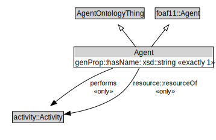

# Agent

<a href="../../diagrams/Agent__Agent.dot.svg">Open interactive Agent diagram</a>

## Formalization for Agent

| Property | Constraint |
|----------|------------|
| genProp::hasName | exactly 1 owl::Thing |
| performs | all activity::Activity |
| resource::resourceOf | all activity::Activity |
| subClassOf | AgentOntologyThing |
| subClassOf | foaf11::Agent |

