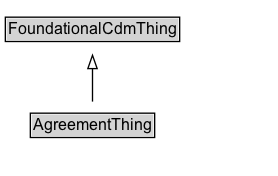

# AgreementThing

Added for organizational purposes, to identify all classes defined in the Agreement pattern.

## Diagram

=== "SVG (interactive)"

    <!-- Generated by graphviz version 14.1.3 (20260303.0454)
     -->
    <!-- Pages: 1 -->
    <svg width="208pt" height="132pt"
     viewBox="0.00 0.00 208.00 132.00" xmlns="http://www.w3.org/2000/svg" xmlns:xlink="http://www.w3.org/1999/xlink">
    <g id="graph0" class="graph" transform="scale(1 1) rotate(0) translate(4 128)">
    <polygon fill="white" stroke="none" points="-4,4 -4,-128 204.38,-128 204.38,4 -4,4"/>
    <g id="clust3" class="cluster">
    <title>cluster_associated</title>
    </g>
    <!-- FoundationalCdmThing -->
    <g id="node1" class="node">
    <title>FoundationalCdmThing</title>
    <g id="a_node1"><a xlink:href="../FoundationalCdmThing" xlink:title="&lt;TABLE&gt;">
    <polygon fill="lightgray" stroke="none" points="1,-97.88 1,-114.12 129.75,-114.12 129.75,-97.88 1,-97.88"/>
    <text xml:space="preserve" text-anchor="start" x="2" y="-101.88" font-family="Arial" font-size="12.00">FoundationalCdmThing</text>
    <polygon fill="none" stroke="black" points="0,-96.88 0,-115.12 130.75,-115.12 130.75,-96.88 0,-96.88"/>
    </a>
    </g>
    </g>
    <!-- AgreementThing -->
    <g id="node2" class="node">
    <title>AgreementThing</title>
    <g id="a_node2"><a xlink:href="../AgreementThing" xlink:title="&lt;TABLE&gt;">
    <polygon fill="lightgray" stroke="none" points="19.75,-25.88 19.75,-42.12 111,-42.12 111,-25.88 19.75,-25.88"/>
    <text xml:space="preserve" text-anchor="start" x="20.75" y="-29.88" font-family="Arial" font-size="12.00">AgreementThing</text>
    <polygon fill="none" stroke="black" points="18.75,-24.88 18.75,-43.12 112,-43.12 112,-24.88 18.75,-24.88"/>
    </a>
    </g>
    </g>
    <!-- AgreementThing&#45;&gt;FoundationalCdmThing -->
    <g id="edge1" class="edge">
    <title>AgreementThing&#45;&gt;FoundationalCdmThing</title>
    <path fill="none" stroke="black" d="M65.38,-51.79C65.38,-59.25 65.38,-68.24 65.38,-76.69"/>
    <polygon fill="none" stroke="black" points="61.88,-76.54 65.38,-86.54 68.88,-76.54 61.88,-76.54"/>
    </g>
    <!-- Invis -->
    </g>
    </svg>

=== "PNG"

    

## Specializations of AgreementThing

| Class | Description |
|-------|-------------|
| [Agent](Agent.md) | An Agent affects, is affected by, or performs some Activity(s). An Agent may be a Person or Organization, but not Software or a Mechanical Device (at this time). An Agent can be a member of an organization and hold zero or more posts in an organization. |
| [Agreement](Agreement.md) | An agreement exists between two or more agents. It is established at some point in time and it may be considered valid only in some Location and/or for some interval in time. An agreement may be defined at varying levels of detail, this is supported with the introduction of the ComplexAgreement and AtomicAgreement class. Finally, agreements involve some specification of rights or commitments of the involved parties. This is represented as a relationship between the involved Agent and a particular activity.  |
| [Atomic Agreement](AtomicAgreement.md) | An atomic agreement is a simple agreement that cannot be further decomposed into sub-agreements. It is a subclass of Agreement and specifies the “essence” of an agreement.  In particular it identifies how agents participating in the agreement are involved: whether they have a claim, duty, no-claim or privilege with respect to some activity that is committed to in the agreement. |
| [Complex Agreement](ComplexAgreement.md) | A complex agreement is an agreement that is composed of two or more atomic agreements. It is a subclass of Agreement and specifies the “essence” of a complex agreement.  In particular it identifies how atomic agreements are composed to form a complex agreement. |
| [Conjunctive Agreement](ConjunctiveAgreement.md) | A conjunctive agreement is a complex agreement where all sub-agreements must be satisfied for the overall agreement to hold. |
| [Disjunctive Agreement](DisjunctiveAgreement.md) | A disjunctive agreement is a complex agreement where at least one sub-agreement must be satisfied for the overall agreement to hold. |
| [Organization](Organization.md) | A collection of people organized together into a community or other social, commercial or political structure. The group has some common purpose or reason for existence which goes beyond the set of people belonging to it. An organization may itself be able to act as an agent.
        In addition to the standard org:Organization pattern, this ontology defines an cdm1:Organization to be a subclass of an cdm1:Agent. |

## Formalization for AgreementThing

| Property | Constraint |
|----------|------------|
| subClassOf | [FoundationalCdmThing](FoundationalCdmThing.md) |

