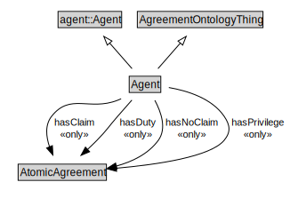

# Agent

<a href="../../diagrams/Agreement__Agent.dot.svg">Open interactive Agent diagram</a>

## Formalization for Agent

| Property | Constraint |
|----------|------------|
| hasClaim | all AtomicAgreement |
| hasDuty | all AtomicAgreement |
| hasNoClaim | all AtomicAgreement |
| hasPrivilege | all AtomicAgreement |
| subClassOf | agent::Agent |
| subClassOf | AgreementOntologyThing |

