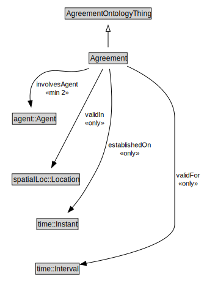

# Agreement

<a href="../../diagrams/Agreement__Agreement.dot.svg">Open interactive Agreement diagram</a>

## Specializations of Agreement

| Class | Description |
|-------|-------------|
| [Atomic Agreement](Agreement__Atomic Agreement.md) |  |
| [Complex Agreement](Agreement__Complex Agreement.md) |  |
| [Conjunctive Agreement (Agreement)](Agreement__ConjunctiveAgreement.md) |  |
| [Disjunctive Agreement (Agreement)](Agreement__DisjunctiveAgreement.md) |  |

## Formalization for Agreement

| Property | Constraint |
|----------|------------|
| establishedOn | all time::Instant |
| involvesAgent | min 2 owl::Thing |
| subClassOf | AgreementOntologyThing |
| validFor | all time::Interval |
| validIn | all spatialLoc::Location |

