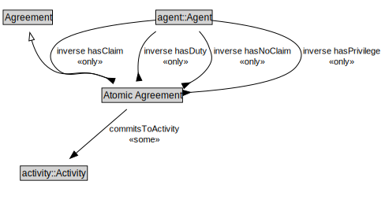

# Atomic Agreement

<a href="../../diagrams/Agreement__Atomic Agreement.dot.svg">Open interactive Atomic Agreement diagram</a>

## Formalization for Atomic Agreement

| Property | Constraint |
|----------|------------|
| commitsToActivity | some activity::Activity |
| disjointWith | ComplexAgreement |
| inverse hasClaim | all agent::Agent |
| inverse hasDuty | all agent::Agent |
| inverse hasNoClaim | all agent::Agent |
| inverse hasPrivilege | all agent::Agent |
| subClassOf | Agreement |

## Used by classes

| Class | Property |
|-------|----------|
| [Agent (Agreement)](Agreement__Agent.md) | hasClaim |
| [Agent (Agreement)](Agreement__Agent.md) | hasDuty |
| [Agent (Agreement)](Agreement__Agent.md) | hasNoClaim |
| [Agent (Agreement)](Agreement__Agent.md) | hasPrivilege |

