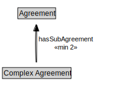

# Complex Agreement

<a href="../../diagrams/Agreement__Complex Agreement.dot.svg">Open interactive Complex Agreement diagram</a>

## Specializations of Complex Agreement

| Class | Description |
|-------|-------------|
| [Conjunctive Agreement (Agreement)](Agreement__ConjunctiveAgreement.md) |  |
| [Disjunctive Agreement (Agreement)](Agreement__DisjunctiveAgreement.md) |  |

## Formalization for Complex Agreement

| Property | Constraint |
|----------|------------|
| hasSubAgreement | min 2 owl::Thing |
| subClassOf | Agreement |

