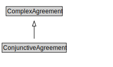

# ConjunctiveAgreement

<a href="../../diagrams/Agreement__ConjunctiveAgreement.dot.svg">Open interactive ConjunctiveAgreement diagram</a>

## Formalization for ConjunctiveAgreement

| Property | Constraint |
|----------|------------|
| disjointWith | DisjunctiveAgreement |
| subClassOf | ComplexAgreement |

