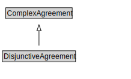

# DisjunctiveAgreement

<a href="../../diagrams/Agreement__DisjunctiveAgreement.dot.svg">Open interactive DisjunctiveAgreement diagram</a>

## Formalization for DisjunctiveAgreement

| Property | Constraint |
|----------|------------|
| subClassOf | ComplexAgreement |

