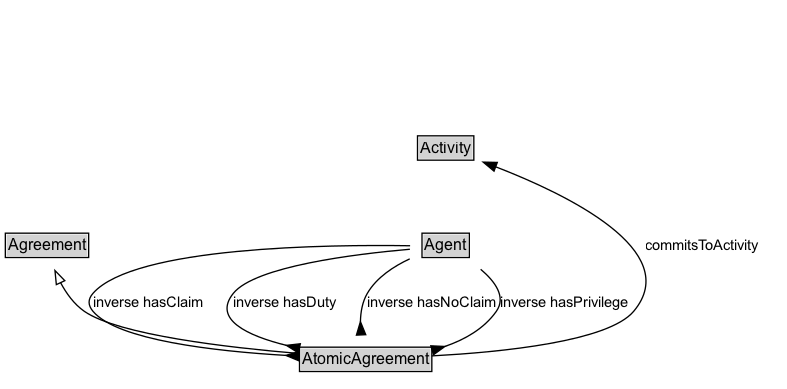

# AtomicAgreement

An atomic agreement is a simple agreement that cannot be further decomposed into sub-agreements. It is a subclass of Agreement and specifies the “essence” of an agreement.  In particular it identifies how agents participating in the agreement are involved: whether they have a claim, duty, no-claim or privilege with respect to some activity that is committed to in the agreement.

## Diagram

=== "SVG (interactive)"

    <!-- Generated by graphviz version 14.1.3 (20260303.0454)
     -->
    <!-- Pages: 1 -->
    <svg width="590pt" height="292pt"
     viewBox="0.00 0.00 590.00 292.00" xmlns="http://www.w3.org/2000/svg" xmlns:xlink="http://www.w3.org/1999/xlink">
    <g id="graph0" class="graph" transform="scale(1 1) rotate(0) translate(4 287.5)">
    <polygon fill="white" stroke="none" points="-4,4 -4,-287.5 585.91,-287.5 585.91,4 -4,4"/>
    <g id="clust3" class="cluster">
    <title>cluster_associated</title>
    </g>
    <!-- Agreement -->
    <g id="node1" class="node">
    <title>Agreement</title>
    <g id="a_node1"><a xlink:href="../Agreement" xlink:title="&lt;TABLE&gt;">
    <polygon fill="lightgray" stroke="none" points="1,-95.38 1,-111.62 61.5,-111.62 61.5,-95.38 1,-95.38"/>
    <text xml:space="preserve" text-anchor="start" x="2" y="-99.38" font-family="Arial" font-size="12.00">Agreement</text>
    <polygon fill="none" stroke="black" points="0,-94.38 0,-112.62 62.5,-112.62 62.5,-94.38 0,-94.38"/>
    </a>
    </g>
    </g>
    <!-- AtomicAgreement -->
    <g id="node2" class="node">
    <title>AtomicAgreement</title>
    <g id="a_node2"><a xlink:href="../AtomicAgreement" xlink:title="&lt;TABLE&gt;">
    <polygon fill="lightgray" stroke="none" points="221.62,-9.88 221.62,-26.12 318.88,-26.12 318.88,-9.88 221.62,-9.88"/>
    <text xml:space="preserve" text-anchor="start" x="222.62" y="-13.88" font-family="Arial" font-size="12.00">AtomicAgreement</text>
    <polygon fill="none" stroke="black" points="220.62,-8.88 220.62,-27.12 319.88,-27.12 319.88,-8.88 220.62,-8.88"/>
    </a>
    </g>
    </g>
    <!-- AtomicAgreement&#45;&gt;Agreement -->
    <g id="edge1" class="edge">
    <title>AtomicAgreement&#45;&gt;Agreement</title>
    <path fill="none" stroke="black" d="M220.72,-22.35C166.76,-26.83 84.74,-36.34 59.25,-54 51.58,-59.31 45.73,-67.46 41.41,-75.56"/>
    <polygon fill="none" stroke="black" points="38.25,-74.04 37.22,-84.58 44.6,-76.98 38.25,-74.04"/>
    </g>
    <!-- Invis -->
    <!-- AtomicAgreement&#45;&gt;Invis -->
    <!-- Activity -->
    <g id="node4" class="node">
    <title>Activity</title>
    <g id="a_node4"><a xlink:href="../Activity" xlink:title="&lt;TABLE&gt;">
    <polygon fill="lightgray" stroke="none" points="310.12,-168.38 310.12,-184.62 350.38,-184.62 350.38,-168.38 310.12,-168.38"/>
    <text xml:space="preserve" text-anchor="start" x="311.12" y="-172.38" font-family="Arial" font-size="12.00">Activity</text>
    <polygon fill="none" stroke="black" points="309.12,-167.38 309.12,-185.62 351.38,-185.62 351.38,-167.38 309.12,-167.38"/>
    </a>
    </g>
    </g>
    <!-- AtomicAgreement&#45;&gt;Activity -->
    <g id="edge5" class="edge">
    <title>AtomicAgreement&#45;&gt;Activity</title>
    <path fill="none" stroke="black" d="M319.82,-20.57C372.96,-23.41 452.27,-31.43 471.25,-54 509.29,-99.23 421,-141.85 367.48,-162.5"/>
    <polygon fill="black" stroke="black" points="366.51,-159.13 358.38,-165.92 368.97,-165.68 366.51,-159.13"/>
    <text xml:space="preserve" text-anchor="middle" x="522.77" y="-99.8" font-family="Arial" font-size="11.00">commitsToActivity</text>
    </g>
    <!-- Invis&#45;&gt;Activity -->
    <!-- Agent -->
    <g id="node5" class="node">
    <title>Agent</title>
    <g id="a_node5"><a xlink:href="../Agent" xlink:title="&lt;TABLE&gt;">
    <polygon fill="lightgray" stroke="none" points="313.5,-95.38 313.5,-111.62 347,-111.62 347,-95.38 313.5,-95.38"/>
    <text xml:space="preserve" text-anchor="start" x="314.5" y="-99.38" font-family="Arial" font-size="12.00">Agent</text>
    <polygon fill="none" stroke="black" points="312.5,-94.38 312.5,-112.62 348,-112.62 348,-94.38 312.5,-94.38"/>
    </a>
    </g>
    </g>
    <!-- Activity&#45;&gt;Agent -->
    <!-- Agent&#45;&gt;AtomicAgreement -->
    <g id="edge6" class="edge">
    <title>Agent&#45;&gt;AtomicAgreement</title>
    <path fill="none" stroke="black" d="M303.57,-103.19C242.72,-104.13 96.51,-102.6 65.75,-67.5 61.8,-62.99 61.88,-58.59 65.75,-54 83.98,-32.38 156.79,-24.12 210.37,-20.96"/>
    <polygon fill="black" stroke="black" points="220.49,-23.91 210.32,-20.96 220.11,-16.92 220.49,-23.91"/>
    <text xml:space="preserve" text-anchor="middle" x="107" y="-57.05" font-family="Arial" font-size="11.00">inverse hasClaim</text>
    </g>
    <!-- Agent&#45;&gt;AtomicAgreement -->
    <g id="edge7" class="edge">
    <title>Agent&#45;&gt;AtomicAgreement</title>
    <path fill="none" stroke="black" d="M303.42,-100.57C262.45,-97 187.32,-87.8 171,-67.5 155.29,-47.96 181.5,-35.73 210.92,-28.44"/>
    <polygon fill="black" stroke="black" points="221.25,-29.68 210.73,-28.48 219.7,-22.85 221.25,-29.68"/>
    <text xml:space="preserve" text-anchor="middle" x="209.62" y="-57.05" font-family="Arial" font-size="11.00">inverse hasDuty</text>
    </g>
    <!-- Agent&#45;&gt;AtomicAgreement -->
    <g id="edge8" class="edge">
    <title>Agent&#45;&gt;AtomicAgreement</title>
    <path fill="none" stroke="black" d="M303.3,-93.35C291.39,-87.83 278.52,-79.49 271.5,-67.5 267.78,-61.15 266.46,-53.49 266.32,-46.15"/>
    <polygon fill="black" stroke="black" points="270.31,-36.49 266.32,-46.3 263.32,-36.14 270.31,-36.49"/>
    <text xml:space="preserve" text-anchor="middle" x="319.88" y="-57.05" font-family="Arial" font-size="11.00">inverse hasNoClaim</text>
    </g>
    <!-- Agent&#45;&gt;AtomicAgreement -->
    <g id="edge9" class="edge">
    <title>Agent&#45;&gt;AtomicAgreement</title>
    <path fill="none" stroke="black" d="M356.5,-85.54C367.35,-76.37 375.83,-64.75 368.25,-54 359.07,-40.98 344.59,-32.77 329.54,-27.61"/>
    <polygon fill="black" stroke="black" points="321.11,-21.43 329.69,-27.66 319.1,-28.14 321.11,-21.43"/>
    <text xml:space="preserve" text-anchor="middle" x="419.14" y="-57.05" font-family="Arial" font-size="11.00">inverse hasPrivilege</text>
    </g>
    </g>
    </svg>

=== "PNG"

    

## Formalization for AtomicAgreement

| Property | Constraint |
|----------|------------|
| [commitsToActivity](../properties/commitsToActivity.md) | some [Activity](Activity.md) |
| [nfc51058336a6463b82427017a4389243b11](../properties/nfc51058336a6463b82427017a4389243b11.md) | only [Agent](Agent.md) |
| [nfc51058336a6463b82427017a4389243b13](../properties/nfc51058336a6463b82427017a4389243b13.md) | only [Agent](Agent.md) |
| [nfc51058336a6463b82427017a4389243b15](../properties/nfc51058336a6463b82427017a4389243b15.md) | only [Agent](Agent.md) |
| [nfc51058336a6463b82427017a4389243b17](../properties/nfc51058336a6463b82427017a4389243b17.md) | only [Agent](Agent.md) |
| disjointWith | [ComplexAgreement](ComplexAgreement.md) |
| subClassOf | [Agreement](Agreement.md) |

## Used by classes

| Class | Property |
|-------|----------|
| [Agent (FuzzyTime)](Agent.md) | [hasClaim](../properties/hasClaim.md) |
| [Agent (FuzzyTime)](Agent.md) | [hasDuty](../properties/hasDuty.md) |
| [Agent (FuzzyTime)](Agent.md) | [hasNoClaim](../properties/hasNoClaim.md) |
| [Agent (FuzzyTime)](Agent.md) | [hasPrivilege](../properties/hasPrivilege.md) |

