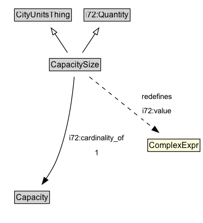

# CapacitySize

## Diagram

=== "SVG (interactive)"

    <!-- Generated by graphviz version 14.1.3 (20260303.0454)
     -->
    <!-- Pages: 1 -->
    <svg width="297pt" height="328pt"
     viewBox="0.00 0.00 297.00 328.00" xmlns="http://www.w3.org/2000/svg" xmlns:xlink="http://www.w3.org/1999/xlink">
    <g id="graph0" class="graph" transform="scale(1 1) rotate(0) translate(4 324)">
    <polygon fill="white" stroke="none" points="-4,4 -4,-324 293.38,-324 293.38,4 -4,4"/>
    <g id="clust3" class="cluster">
    <title>cluster_associated</title>
    </g>
    <!-- CityUnitsThing -->
    <g id="node1" class="node">
    <title>CityUnitsThing</title>
    <g id="a_node1"><a xlink:href="../CityUnitsThing" xlink:title="&lt;TABLE&gt;">
    <polygon fill="lightgray" stroke="none" points="18.25,-293.88 18.25,-310.12 99.75,-310.12 99.75,-293.88 18.25,-293.88"/>
    <text xml:space="preserve" text-anchor="start" x="19.25" y="-297.88" font-family="Arial" font-size="12.00">CityUnitsThing</text>
    <polygon fill="none" stroke="black" points="17.25,-292.88 17.25,-311.12 100.75,-311.12 100.75,-292.88 17.25,-292.88"/>
    </a>
    </g>
    </g>
    <!-- i72_Quantity -->
    <g id="node2" class="node">
    <title>i72_Quantity</title>
    <g id="a_node2"><a xlink:href="https://w3id.org/citydata/21972/v1/Quantity" xlink:title="&lt;TABLE&gt;">
    <polygon fill="lightgray" stroke="none" points="120.12,-293.88 120.12,-310.12 185.88,-310.12 185.88,-293.88 120.12,-293.88"/>
    <text xml:space="preserve" text-anchor="start" x="121.12" y="-297.88" font-family="Arial" font-size="12.00">i72:Quantity</text>
    <polygon fill="none" stroke="black" points="119.12,-292.88 119.12,-311.12 186.88,-311.12 186.88,-292.88 119.12,-292.88"/>
    </a>
    </g>
    </g>
    <!-- CapacitySize -->
    <g id="node3" class="node">
    <title>CapacitySize</title>
    <g id="a_node3"><a xlink:href="../CapacitySize" xlink:title="&lt;TABLE&gt;">
    <polygon fill="lightgray" stroke="none" points="69.38,-220.88 69.38,-237.12 142.62,-237.12 142.62,-220.88 69.38,-220.88"/>
    <text xml:space="preserve" text-anchor="start" x="70.38" y="-224.88" font-family="Arial" font-size="12.00">CapacitySize</text>
    <polygon fill="none" stroke="black" points="68.38,-219.88 68.38,-238.12 143.62,-238.12 143.62,-219.88 68.38,-219.88"/>
    </a>
    </g>
    </g>
    <!-- CapacitySize&#45;&gt;CityUnitsThing -->
    <g id="edge1" class="edge">
    <title>CapacitySize&#45;&gt;CityUnitsThing</title>
    <path fill="none" stroke="black" d="M94.94,-246.71C89.39,-255.09 82.55,-265.43 76.32,-274.84"/>
    <polygon fill="none" stroke="black" points="73.58,-272.64 70.97,-282.91 79.41,-276.51 73.58,-272.64"/>
    </g>
    <!-- CapacitySize&#45;&gt;i72_Quantity -->
    <g id="edge2" class="edge">
    <title>CapacitySize&#45;&gt;i72_Quantity</title>
    <path fill="none" stroke="black" d="M117.06,-246.71C122.61,-255.09 129.45,-265.43 135.68,-274.84"/>
    <polygon fill="none" stroke="black" points="132.59,-276.51 141.03,-282.91 138.42,-272.64 132.59,-276.51"/>
    </g>
    <!-- Invis -->
    <!-- CapacitySize&#45;&gt;Invis -->
    <!-- Capacity -->
    <g id="node5" class="node">
    <title>Capacity</title>
    <g id="a_node5"><a xlink:href="../Capacity" xlink:title="&lt;TABLE&gt;">
    <polygon fill="lightgray" stroke="none" points="18.38,-25.88 18.38,-42.12 67.62,-42.12 67.62,-25.88 18.38,-25.88"/>
    <text xml:space="preserve" text-anchor="start" x="19.38" y="-29.88" font-family="Arial" font-size="12.00">Capacity</text>
    <polygon fill="none" stroke="black" points="17.38,-24.88 17.38,-43.12 68.62,-43.12 68.62,-24.88 17.38,-24.88"/>
    </a>
    </g>
    </g>
    <!-- CapacitySize&#45;&gt;Capacity -->
    <g id="edge5" class="edge">
    <title>CapacitySize&#45;&gt;Capacity</title>
    <path fill="none" stroke="black" d="M104.87,-211.13C102.62,-184.34 96.19,-130.84 79,-89 75.06,-79.41 69.3,-69.74 63.54,-61.29"/>
    <polygon fill="black" stroke="black" points="66.44,-59.32 57.77,-53.23 60.75,-63.39 66.44,-59.32"/>
    <polygon fill="white" stroke="none" points="93.55,-89 93.55,-132 181.8,-132 181.8,-89 93.55,-89"/>
    <text xml:space="preserve" text-anchor="start" x="97.55" y="-117.5" font-family="Arial" font-size="11.00">i72:cardinality_of</text>
    <text xml:space="preserve" text-anchor="start" x="134.68" y="-96" font-family="Arial" font-size="11.00">1</text>
    </g>
    <!-- ncbd96c33227149b1a64e837a10238d87b10 -->
    <g id="node6" class="node">
    <title>ncbd96c33227149b1a64e837a10238d87b10</title>
    <polygon fill="lightyellow" stroke="none" points="212.62,-101.38 212.62,-119.62 289.38,-119.62 289.38,-101.38 212.62,-101.38"/>
    <text xml:space="preserve" text-anchor="start" x="214.62" y="-106.38" font-family="Arial" font-size="12.00">ComplexExpr</text>
    <polygon fill="none" stroke="black" points="212.62,-101.38 212.62,-119.62 289.38,-119.62 289.38,-101.38 212.62,-101.38"/>
    </g>
    <!-- CapacitySize&#45;&gt;ncbd96c33227149b1a64e837a10238d87b10 -->
    <g id="edge6" class="edge">
    <title>CapacitySize&#45;&gt;ncbd96c33227149b1a64e837a10238d87b10</title>
    <path fill="none" stroke="black" stroke-dasharray="5,2" d="M127.08,-211.06C151.78,-191.22 192.88,-158.19 220.92,-135.66"/>
    <polygon fill="black" stroke="black" points="223.11,-138.4 228.71,-129.41 218.72,-132.94 223.11,-138.4"/>
    <polygon fill="white" stroke="none" points="199.96,-150 199.96,-193 252.21,-193 252.21,-150 199.96,-150"/>
    <text xml:space="preserve" text-anchor="start" x="203.96" y="-178.5" font-family="Arial" font-size="11.00">redefines</text>
    <text xml:space="preserve" text-anchor="start" x="204.71" y="-157" font-family="Arial" font-size="11.00">i72:value</text>
    </g>
    <!-- Invis&#45;&gt;Capacity -->
    </g>
    </svg>

=== "PNG"

    

## Formalization for CapacitySize

| Property | Constraint |
|----------|------------|
| [i72:cardinality_of](https://w3id.org/citydata/21972/v1/cardinality_of) | exactly 1 |
| [i72:cardinality_of](https://w3id.org/citydata/21972/v1/cardinality_of) | exactly 1 [Capacity](https://w3id.org/citydata/part1/v1/Capacity) |
| subClassOf | [i72:Quantity](i72:Quantity.md) |
| subClassOf | [CityUnitsThing](CityUnitsThing.md) |

