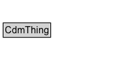

# CdmThing

Added for organizational purposes, to identify all classes defined in the City Data Model.

## Diagram

=== "SVG (interactive)"

    <!-- Generated by graphviz version 14.1.3 (20260303.0454)
     -->
    <!-- Pages: 1 -->
    <svg width="156pt" height="76pt"
     viewBox="0.00 0.00 156.00 76.00" xmlns="http://www.w3.org/2000/svg" xmlns:xlink="http://www.w3.org/1999/xlink">
    <g id="graph0" class="graph" transform="scale(1 1) rotate(0) translate(4 72)">
    <polygon fill="white" stroke="none" points="-4,4 -4,-72 152.12,-72 152.12,4 -4,4"/>
    <g id="clust3" class="cluster">
    <title>cluster_associated</title>
    </g>
    <!-- CdmThing -->
    <g id="node1" class="node">
    <title>CdmThing</title>
    <g id="a_node1"><a xlink:href="../CdmThing" xlink:title="&lt;TABLE&gt;">
    <polygon fill="lightgray" stroke="none" points="1,-25.88 1,-42.12 59.25,-42.12 59.25,-25.88 1,-25.88"/>
    <text xml:space="preserve" text-anchor="start" x="2" y="-29.88" font-family="Arial" font-size="12.00">CdmThing</text>
    <polygon fill="none" stroke="black" points="0,-24.88 0,-43.12 60.25,-43.12 60.25,-24.88 0,-24.88"/>
    </a>
    </g>
    </g>
    <!-- Invis -->
    </g>
    </svg>

=== "PNG"

    

## Specializations of CdmThing

| Class | Description |
|-------|-------------|
| [Acceleration](Acceleration.md) |  |
| [Acceleration Unit](AccelerationUnit.md) |  |
| [Activity](Activity.md) | An Activity describes something that occurs in the domain.
An Activity may be further defined by (decomposed into) Subactivities.
An Activity may have precondition and/or effect State.
An Activity may be enabled by or cause some State. An enabling of causing state is a generalization of a precondition/effect; an Activity is enabled by or causes some State if it has a subactivity with a precondition or effect (respectively) of that State. 
In other words, the state may not be required directly before, or cause directly after the activity, but by some more specialized sub-activity.
An Activity occurs at some point in time and space.
An Activity takes place during some interval, and so has some duration.
An Activity may have some Manifestations that participate in it. |
| [Activity Status](ActivityStatus.md) | The status of the Activity. |
| [Activity Thing](ActivityThing.md) | Added for organizational purposes, to identify all classes defined in the Activity pattern. |
| [Agent](Agent.md) | An Agent affects, is affected by, or performs some Activity(s). An Agent may be a Person or Organization, but not Software or a Mechanical Device (at this time). An Agent can be a member of an organization and hold zero or more posts in an organization. |
| [Agent](Agent.md) | An Agent affects, is affected by, or performs some Activity(s). An Agent may be a Person or Organization, but not Software or a Mechanical Device (at this time). An Agent can be a member of an organization and hold zero or more posts in an organization. |
| [Agent Thing](AgentThing.md) | Added for organizational purposes, to identify all classes defined in the Agent pattern. |
| [Agreement](Agreement.md) | An agreement exists between two or more agents. It is established at some point in time and it may be considered valid only in some Location and/or for some interval in time. An agreement may be defined at varying levels of detail, this is supported with the introduction of the ComplexAgreement and AtomicAgreement class. Finally, agreements involve some specification of rights or commitments of the involved parties. This is represented as a relationship between the involved Agent and a particular activity.  |
| [Agreement Thing](AgreementThing.md) | Added for organizational purposes, to identify all classes defined in the Agreement pattern. |
| [Amount Of Money](AmountOfMoney.md) |  |
| [Area](Area.md) | Area expresses the two-dimensional size of a defined part of a surface, typically a region bounded by a closed curve. It is a derived quantity in the International System of Units. Area is length squared. |
| [Area Unit](AreaUnit.md) | Unit of area in the specified system of units. |
| [Atomic Agreement](AtomicAgreement.md) | An atomic agreement is a simple agreement that cannot be further decomposed into sub-agreements. It is a subclass of Agreement and specifies the “essence” of an agreement.  In particular it identifies how agents participating in the agreement are involved: whether they have a claim, duty, no-claim or privilege with respect to some activity that is committed to in the agreement. |
| [Capacity](Capacity.md) |  |
| [Capacity Size](CapacitySize.md) |  |
| [Cardinality Measure](CardinalityMeasure.md) |  |
| [Cardinality Unit Per Time](CardinalityUnitPerTime.md) |  |
| [Change Thing](ChangeThing.md) |  |
| [City Units Thing](CityUnitsThing.md) |  |
| [Complex Agreement](ComplexAgreement.md) | A complex agreement is an agreement that is composed of two or more atomic agreements. It is a subclass of Agreement and specifies the “essence” of a complex agreement.  In particular it identifies how atomic agreements are composed to form a complex agreement. |
| [Conjunctive Agreement](ConjunctiveAgreement.md) | A conjunctive agreement is a complex agreement where all sub-agreements must be satisfied for the overall agreement to hold. |
| [Conjunctive State](ConjunctiveState.md) | A type of NonTerminalState that is defined by the conjunction of its child States. |
| [Consume State](ConsumeState.md) | Identifies a Resource and Quantity it consumes. The Quantity is removed from the Resource. |
| [Daily Recurring Event](DailyRecurringEvent.md) | A DailyRecurringEvent is a RecurringEvent that occurs every day. It has a maximum of one associated time, the start time. Typically, a daily recurring event will occur at the same time every day, but it is also possible that no commitment is made to a recurring start time for the event, in which case no start time is specified. A DailyEvent does not necessarily have the same endtime or duration, therefore these are not specified. |
| [Disjunctive Agreement](DisjunctiveAgreement.md) | A disjunctive agreement is a complex agreement where at least one sub-agreement must be satisfied for the overall agreement to hold. |
| [Disjunctive State](DisjunctiveState.md) | A type of NonTerminalState that is defined by the disjunction of its child States. A State cannot be both conjunctive and disjunctive.  |
| [Divisible Resource](DivisibleResource.md) | A Resource that can be divided for use or consumption between multiple Activities. |
| [Duration](Duration.md) | Duration is the amount of time that elapses between two instants or events. |
| [Exception Day](ExceptionDay.md) | An ExceptionDay specifies a day or days that recursExcept and recursAddition use to specify unique days that do not recur on the same day each year, for example, holidays.  |
| [First Manifestation](FirstManifestation.md) | The first recorded manifestation of an individual. No prior manifestations (in time) exist for the individual. It is a subclassOf Manifestation. |
| [Foundational Cdm Thing](FoundationalCdmThing.md) | Added for organizational purposes, to identify all classes defined in the Foundation-level CDM ontology. |
| [Location](Location.md) | A location. |
| [Manifestation](Manifestation.md) | Manifestations may be interpreted as “snapshots” of an object at some point in time. This enables the representation of changing attributes of an object, without losing information about its past values/relationships. The properties of the class must then be identified as properties that are (and aren't) subject to change, in order to distinguish between the static and dynamic aspects of a particular entity. |
| [Manifestation State](ManifestationState.md) | A specialization of TerminalState, the ManifestationState specifies a Manifestation class that an individual must satisfy in order for the ManifestationState to be true. |
| [Monthly Recurring Event](MonthlyRecurringEvent.md) | A MonthlyRecurringEvent recurs regularly on the same day of each month, as specified by the dayOfMonth data property. Note that there is often ambiguity regarding the semantics of a monthly recurring event: in this formalization, a MonthlyRecurringEvent is any event that recurs regularly on the same day of each month; other interpretations sometimes consider events that recur on the same day of week, or first or last day, in which case the day of month will vary. |
| [Non Divisible Resource](NonDivisibleResource.md) | A Resource that can only be used for a single Activity at once - even if it isn't fully utilized. |
| [Non Terminal State](NonTerminalState.md) | A NonTerminalState has child States (a.k.a., sub-states) that are either conjuctive or disjunctive. Each child may be a TerminalState or NonTerminalState; eventually a TerminalState is reached. A State cannot be both non-terminal and terminal. |
| [Organization](Organization.md) | A collection of people organized together into a community or other social, commercial or political structure. The group has some common purpose or reason for existence which goes beyond the set of people belonging to it. An organization may itself be able to act as an agent.
        In addition to the standard org:Organization pattern, this ontology defines an cdm1:Organization to be a subclass of an cdm1:Agent. |
| [Organization](Organization.md) | A collection of people organized together into a community or other social, commercial or political structure. The group has some common purpose or reason for existence which goes beyond the set of people belonging to it. An organization may itself be able to act as an agent.
        In addition to the standard org:Organization pattern, this ontology defines an cdm1:Organization to be a subclass of an cdm1:Agent. |
| [Organization Thing](OrganizationThing.md) | A class representing an organization in the context of the CDM ontology. |
| [Planned Allocation](PlannedAllocation.md) | Specifies the planned allocation of a resource to an activity via a state.
        Note that Allocation is a Manifestation as the allocation may change over time. |
| [Planned Allocation](PlannedAllocation.md) | Specifies the planned allocation of a resource to an activity via a state.
        Note that Allocation is a Manifestation as the allocation may change over time. |
| [Produce State](ProduceState.md) | Identifies a Resource and Quantity it produces. |
| [Recurring Event](RecurringEvent.md) | Recurring events are defined based on the regular interval at which they occur; this is captures using some combination of the hasTime, dayOfWeek, hasMonth, and dayOfMonth properties.  Using these properties, ontology defines the following specializations of the RecurringEvent class. Other subclasses may be defined similarly, as required. |
| [Recurring Event Thing](RecurringEventThing.md) |  |
| [Release State](ReleaseState.md) | Identifies a Resource and Quantity it releases (after using). |
| [Resource](Resource.md) | A Resource is a generic representation of some Thing that can be "used" in an Activity. 
        A Resource may have some Location, amount or availability, according to the definition of the Manifestation or TimeVaryingEntity. 
        A Resource must be classified as some Resource Type.
        A Resource may participate in some Activity Occurrence. In other words, it links to the Activity that the Resource is being used/consumed/produced/released at the time of the manifestation.
        A specific Resource may be used in or consumed in some activity occurrence. |
| [Resource Thing](ResourceThing.md) | Added for organizational purposes, to identify all classes defined in the Resource ontology. |
| [Spatial Loc Thing](SpatialLocThing.md) | Added for organizational purposes, to identify all classes defined in the Location pattern of the CDM ontology. |
| [State](State.md) | A State describes some situation in the world which may or may not be satisfied (true) at a given point in time. A State refers to a class of manifestations. It may be a precondition or effect of some Activity, or more generally it may be enabled or be caused by some Activity. If a state is complex, it may refer to some combination of classes of manifestations.
        Example: A shopping activity, Activity-Shop, can require both the VehicleW30LGas state, but also some state wherein the mall is open, OpenMall. Each state is defined separately. The combined state is then defined as the conjunction of the two states. Thus, we could say that the preconditions for Activity-Shop are: precondition(VehicleW30LGas,Activity-Shop) AND  precondition(OpenMall,Activity-Shop). Alternatively, if the preconditions were required disjunctively, we could state: precondition(VehicleW30LGas,Activity-Shop) OR precondition(OpenMall,Activity-Shop).
        In large and complex domains, there can be cases in which the above approach is undesirable. In particular, due to the complexity of the description that results as the state being described becomes more detailed. In many cases it will be more natural and convenient to be able to refer to a single, aggregate state. We therefore extend the representation of States to capture aggregation, as approached in the concept of state trees introduced by TOVE as a construct for the activity cluster.
        A State may be either non-terminal or terminal. A terminal state has no child states, and therefore refers directly to a class of manifestations, whereas a non-terminal state has child states, which may define some classes of manifestations, or further define some other complex states.
            NonTerminalState(x) v TerminalState(x) = State(x)
        A state  cannot be both non-terminal and terminal.
            TerminalState disjointWith NonTerminalState |
| [State Status](StateStatus.md) |  |
| [Terminal Resource State](TerminalResourceState.md) |  |
| [Terminal Resource State](TerminalResourceState.md) |  |
| [Terminal State](TerminalState.md) | A terminal state type has no substates (cannot be decomposed). It corresponds to a particular class of manifestations. A terminal state is achieved at some time if and only if there exists a manifestation within its defined classification, that exists at that time. |
| [Use State](UseState.md) | Identifies a Resource and Quantity it uses (without consuming). |
| [Value Of Money](ValueOfMoney.md) | An amount of money that is defined relative to a particular year. |
| [Weekly Recurring Event](WeeklyRecurringEvent.md) | A WeeklyRecurringEvent recurs on the regularly on the same day of the week, as specified by the schema:dayOfWeek property. |
| [Yearly Recurring Event](YearlyRecurringEvent.md) | A YearlyRecurringEvent recurs regularly on the same day of the same month, as specified by the hasMonth and dayOfMonth properties. As with MonthlyRecurringEvent, there may be ambiguity regarding the semantics of a yearly recurring event, however this formalization captures only the notion of an event that recurs on the same day of the same month (e.g. a birthday). |

