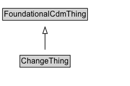

# ChangeThing

## Diagram

=== "SVG (interactive)"

    <!-- Generated by graphviz version 14.1.3 (20260303.0454)
     -->
    <!-- Pages: 1 -->
    <svg width="200pt" height="132pt"
     viewBox="0.00 0.00 200.00 132.00" xmlns="http://www.w3.org/2000/svg" xmlns:xlink="http://www.w3.org/1999/xlink">
    <g id="graph0" class="graph" transform="scale(1 1) rotate(0) translate(4 128)">
    <polygon fill="white" stroke="none" points="-4,4 -4,-128 196.38,-128 196.38,4 -4,4"/>
    <g id="clust3" class="cluster">
    <title>cluster_associated</title>
    </g>
    <!-- FoundationalCdmThing -->
    <g id="node1" class="node">
    <title>FoundationalCdmThing</title>
    <g id="a_node1"><a xlink:href="../FoundationalCdmThing" xlink:title="&lt;TABLE&gt;">
    <polygon fill="lightgray" stroke="none" points="1,-97.88 1,-114.12 129.75,-114.12 129.75,-97.88 1,-97.88"/>
    <text xml:space="preserve" text-anchor="start" x="2" y="-101.88" font-family="Arial" font-size="12.00">FoundationalCdmThing</text>
    <polygon fill="none" stroke="black" points="0,-96.88 0,-115.12 130.75,-115.12 130.75,-96.88 0,-96.88"/>
    </a>
    </g>
    </g>
    <!-- ChangeThing -->
    <g id="node2" class="node">
    <title>ChangeThing</title>
    <g id="a_node2"><a xlink:href="../ChangeThing" xlink:title="&lt;TABLE&gt;">
    <polygon fill="lightgray" stroke="none" points="27.62,-25.88 27.62,-42.12 103.12,-42.12 103.12,-25.88 27.62,-25.88"/>
    <text xml:space="preserve" text-anchor="start" x="28.62" y="-29.88" font-family="Arial" font-size="12.00">ChangeThing</text>
    <polygon fill="none" stroke="black" points="26.62,-24.88 26.62,-43.12 104.12,-43.12 104.12,-24.88 26.62,-24.88"/>
    </a>
    </g>
    </g>
    <!-- ChangeThing&#45;&gt;FoundationalCdmThing -->
    <g id="edge1" class="edge">
    <title>ChangeThing&#45;&gt;FoundationalCdmThing</title>
    <path fill="none" stroke="black" d="M65.38,-51.79C65.38,-59.25 65.38,-68.24 65.38,-76.69"/>
    <polygon fill="none" stroke="black" points="61.88,-76.54 65.38,-86.54 68.88,-76.54 61.88,-76.54"/>
    </g>
    <!-- Invis -->
    </g>
    </svg>

=== "PNG"

    

## Specializations of ChangeThing

| Class | Description |
|-------|-------------|
| [First Manifestation](FirstManifestation.md) | The first recorded manifestation of an individual. No prior manifestations (in time) exist for the individual. It is a subclassOf Manifestation. |
| [Manifestation](Manifestation.md) | Manifestations may be interpreted as “snapshots” of an object at some point in time. This enables the representation of changing attributes of an object, without losing information about its past values/relationships. The properties of the class must then be identified as properties that are (and aren't) subject to change, in order to distinguish between the static and dynamic aspects of a particular entity. |
| [Planned Allocation](PlannedAllocation.md) | Specifies the planned allocation of a resource to an activity via a state.
        Note that Allocation is a Manifestation as the allocation may change over time. |

## Formalization for ChangeThing

| Property | Constraint |
|----------|------------|
| subClassOf | [FoundationalCdmThing](FoundationalCdmThing.md) |

