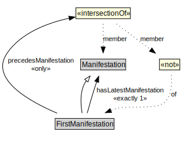

# FirstManifestation

<a href="../../diagrams/Change__FirstManifestation.dot.svg">Open interactive FirstManifestation diagram</a>

## Formalization for FirstManifestation

| Property | Constraint |
|----------|------------|
| hasLatestManifestation | exactly 1 owl::Thing |
| precedesManifestation | all Manifestation and not FirstManifestation |
| subClassOf | Manifestation |

