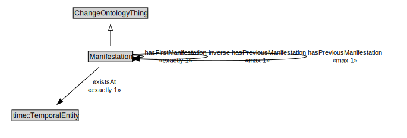

# Manifestation

<a href="../../diagrams/Change__Manifestation.dot.svg">Open interactive Manifestation diagram</a>

## Specializations of Manifestation

| Class | Description |
|-------|-------------|
| [First Manifestation (Change)](Change__FirstManifestation.md) |  |

## Formalization for Manifestation

| Property | Constraint |
|----------|------------|
| existsAt | exactly 1 owl::Thing |
| hasFirstManifestation | exactly 1 owl::Thing |
| hasPreviousManifestation | max 1 owl::Thing |
| inverse hasPreviousManifestation | max 1 owl::Thing |
| subClassOf | ChangeOntologyThing |

