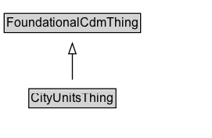

# CityUnitsThing

## Diagram

=== "SVG (interactive)"

    <!-- Generated by graphviz version 14.1.3 (20260303.0454)
     -->
    <!-- Pages: 1 -->
    <svg width="203pt" height="132pt"
     viewBox="0.00 0.00 203.00 132.00" xmlns="http://www.w3.org/2000/svg" xmlns:xlink="http://www.w3.org/1999/xlink">
    <g id="graph0" class="graph" transform="scale(1 1) rotate(0) translate(4 128)">
    <polygon fill="white" stroke="none" points="-4,4 -4,-128 199.38,-128 199.38,4 -4,4"/>
    <g id="clust3" class="cluster">
    <title>cluster_associated</title>
    </g>
    <!-- FoundationalCdmThing -->
    <g id="node1" class="node">
    <title>FoundationalCdmThing</title>
    <g id="a_node1"><a xlink:href="../FoundationalCdmThing" xlink:title="&lt;TABLE&gt;">
    <polygon fill="lightgray" stroke="none" points="1,-97.88 1,-114.12 129.75,-114.12 129.75,-97.88 1,-97.88"/>
    <text xml:space="preserve" text-anchor="start" x="2" y="-101.88" font-family="Arial" font-size="12.00">FoundationalCdmThing</text>
    <polygon fill="none" stroke="black" points="0,-96.88 0,-115.12 130.75,-115.12 130.75,-96.88 0,-96.88"/>
    </a>
    </g>
    </g>
    <!-- CityUnitsThing -->
    <g id="node2" class="node">
    <title>CityUnitsThing</title>
    <g id="a_node2"><a xlink:href="../CityUnitsThing" xlink:title="&lt;TABLE&gt;">
    <polygon fill="lightgray" stroke="none" points="24.62,-25.88 24.62,-42.12 106.12,-42.12 106.12,-25.88 24.62,-25.88"/>
    <text xml:space="preserve" text-anchor="start" x="25.62" y="-29.88" font-family="Arial" font-size="12.00">CityUnitsThing</text>
    <polygon fill="none" stroke="black" points="23.62,-24.88 23.62,-43.12 107.12,-43.12 107.12,-24.88 23.62,-24.88"/>
    </a>
    </g>
    </g>
    <!-- CityUnitsThing&#45;&gt;FoundationalCdmThing -->
    <g id="edge1" class="edge">
    <title>CityUnitsThing&#45;&gt;FoundationalCdmThing</title>
    <path fill="none" stroke="black" d="M65.38,-51.79C65.38,-59.25 65.38,-68.24 65.38,-76.69"/>
    <polygon fill="none" stroke="black" points="61.88,-76.54 65.38,-86.54 68.88,-76.54 61.88,-76.54"/>
    </g>
    <!-- Invis -->
    </g>
    </svg>

=== "PNG"

    

## Specializations of CityUnitsThing

| Class | Description |
|-------|-------------|
| [Acceleration](Acceleration.md) |  |
| [Acceleration Unit](AccelerationUnit.md) |  |
| [Amount Of Money](AmountOfMoney.md) |  |
| [Area](Area.md) | Area expresses the two-dimensional size of a defined part of a surface, typically a region bounded by a closed curve. It is a derived quantity in the International System of Units. Area is length squared. |
| [Area Unit](AreaUnit.md) | Unit of area in the specified system of units. |
| [Capacity](Capacity.md) |  |
| [Capacity Size](CapacitySize.md) |  |
| [Cardinality Measure](CardinalityMeasure.md) |  |
| [Cardinality Unit Per Time](CardinalityUnitPerTime.md) |  |
| [Duration](Duration.md) | Duration is the amount of time that elapses between two instants or events. |
| [Value Of Money](ValueOfMoney.md) | An amount of money that is defined relative to a particular year. |

## Formalization for CityUnitsThing

| Property | Constraint |
|----------|------------|
| subClassOf | [FoundationalCdmThing](FoundationalCdmThing.md) |

