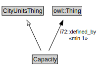

# Capacity

<a href="../../diagrams/CityUnits__Capacity.dot.svg">Open interactive Capacity diagram</a>

## Formalization for Capacity

| Property | Constraint |
|----------|------------|
| i72::defined_by | min 1 owl::Thing |
| subClassOf | CityUnitsThing |

