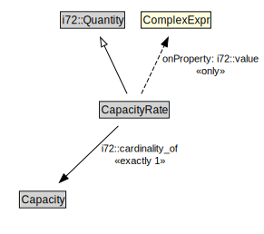

# CapacityRate

<a href="../../diagrams/CityUnits__CapacityRate.dot.svg">Open interactive CapacityRate diagram</a>

## Formalization for CapacityRate

| Property | Constraint |
|----------|------------|
| i72::cardinality_of | exactly 1 owl::Thing |
| i72::value | all ComplexExpr |
| subClassOf | i72::Quantity |

