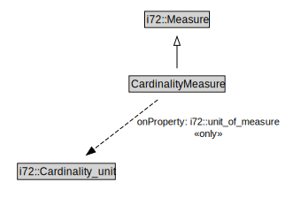

# CardinalityMeasure

<a href="../../diagrams/CityUnits__CardinalityMeasure.dot.svg">Open interactive CardinalityMeasure diagram</a>

## Formalization for CardinalityMeasure

| Property | Constraint |
|----------|------------|
| i72::unit_of_measure | all i72::Cardinality_unit |
| subClassOf | i72::Measure |

