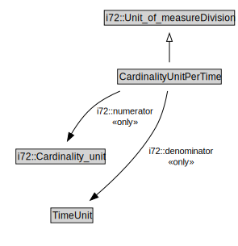

# CardinalityUnitPerTime

<a href="../../diagrams/CityUnits__CardinalityUnitPerTime.dot.svg">Open interactive CardinalityUnitPerTime diagram</a>

## Formalization for CardinalityUnitPerTime

| Property | Constraint |
|----------|------------|
| i72::denominator | all TimeUnit |
| i72::numerator | all i72::Cardinality_unit |
| subClassOf | i72::Unit_of_measureDivision |

