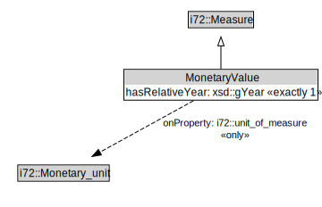

# MonetaryValue

<a href="../../diagrams/CityUnits__MonetaryValue.dot.svg">Open interactive MonetaryValue diagram</a>

## Formalization for MonetaryValue

| Property | Constraint |
|----------|------------|
| hasRelativeYear | exactly 1 owl::Thing |
| i72::unit_of_measure | all i72::Monetary_unit |
| subClassOf | i72::Measure |

## Used by classes

| Class | Property |
|-------|----------|
| [Value Of Money (CityUnits)](CityUnits__ValueOfMoney.md) | i72::value |

