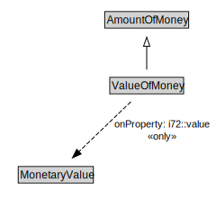

# ValueOfMoney

<a href="../../diagrams/CityUnits__ValueOfMoney.dot.svg">Open interactive ValueOfMoney diagram</a>

## Formalization for ValueOfMoney

| Property | Constraint |
|----------|------------|
| i72::value | all MonetaryValue |
| subClassOf | AmountOfMoney |

