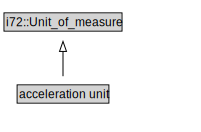

# acceleration unit

<a href="../../diagrams/CityUnits__acceleration unit.dot.svg">Open interactive acceleration unit diagram</a>

## Formalization for acceleration unit

| Property | Constraint |
|----------|------------|
| subClassOf | i72::Unit_of_measure |

