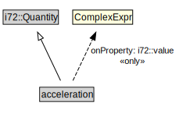

# acceleration

<a href="../../diagrams/CityUnits__acceleration.dot.svg">Open interactive acceleration diagram</a>

## Formalization for acceleration

| Property | Constraint |
|----------|------------|
| i72::value | all ComplexExpr |
| subClassOf | i72::Quantity |

