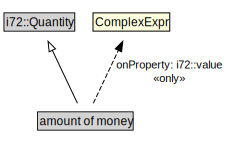

# amount of money

<a href="../../diagrams/CityUnits__amount of money.dot.svg">Open interactive amount of money diagram</a>

## Specializations of amount of money

| Class | Description |
|-------|-------------|
| [Value Of Money (CityUnits)](CityUnits__ValueOfMoney.md) |  |

## Formalization for amount of money

| Property | Constraint |
|----------|------------|
| i72::value | all ComplexExpr |
| subClassOf | i72::Quantity |

