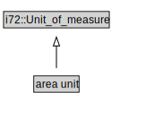

# area unit

<a href="../../diagrams/CityUnits__area unit.dot.svg">Open interactive area unit diagram</a>

## Formalization for area unit

| Property | Constraint |
|----------|------------|
| subClassOf | i72::Unit_of_measure |

