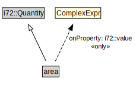

# area

<a href="../../diagrams/CityUnits__area.dot.svg">Open interactive area diagram</a>

## Formalization for area

| Property | Constraint |
|----------|------------|
| i72::value | all ComplexExpr |
| subClassOf | i72::Quantity |

