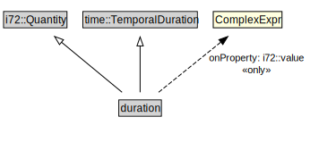

# duration

<a href="../../diagrams/CityUnits__duration.dot.svg">Open interactive duration diagram</a>

## Formalization for duration

| Property | Constraint |
|----------|------------|
| i72::value | all ComplexExpr |
| subClassOf | i72::Quantity |
| subClassOf | time::TemporalDuration |

