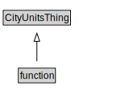

# function

<a href="../../diagrams/CityUnits__function.dot.svg">Open interactive function diagram</a>

## Formalization for function

| Property | Constraint |
|----------|------------|
| subClassOf | CityUnitsThing |

