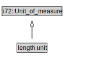

# length unit

<a href="../../diagrams/CityUnits__length unit.dot.svg">Open interactive length unit diagram</a>

## Formalization for length unit

| Property | Constraint |
|----------|------------|
| subClassOf | i72::Unit_of_measure |

