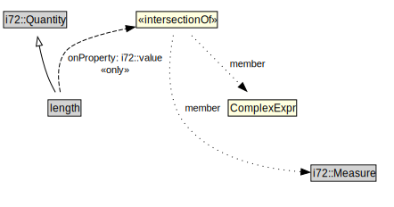

# length

<a href="../../diagrams/CityUnits__length.dot.svg">Open interactive length diagram</a>

## Formalization for length

| Property | Constraint |
|----------|------------|
| i72::value | all ComplexExpr and i72::Measure |
| subClassOf | i72::Quantity |

