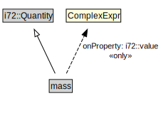

# mass

<a href="../../diagrams/CityUnits__mass.dot.svg">Open interactive mass diagram</a>

## Formalization for mass

| Property | Constraint |
|----------|------------|
| i72::value | all ComplexExpr |
| subClassOf | i72::Quantity |

