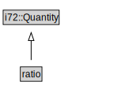

# ratio

<a href="../../diagrams/CityUnits__ratio.dot.svg">Open interactive ratio diagram</a>

## Formalization for ratio

| Property | Constraint |
|----------|------------|
| subClassOf | i72::Quantity |

