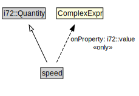

# speed

<a href="../../diagrams/CityUnits__speed.dot.svg">Open interactive speed diagram</a>

## Formalization for speed

| Property | Constraint |
|----------|------------|
| i72::value | all ComplexExpr |
| subClassOf | i72::Quantity |

