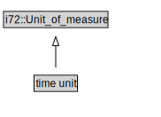

# time unit

<a href="../../diagrams/CityUnits__time unit.dot.svg">Open interactive time unit diagram</a>

## Formalization for time unit

| Property | Constraint |
|----------|------------|
| subClassOf | i72::Unit_of_measure |

## Used by classes

| Class | Property |
|-------|----------|
| [Cardinality Unit Per Time (CityUnits)](CityUnits__CardinalityUnitPerTime.md) | i72::denominator |

