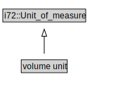

# volume unit

<a href="../../diagrams/CityUnits__volume unit.dot.svg">Open interactive volume unit diagram</a>

## Formalization for volume unit

| Property | Constraint |
|----------|------------|
| subClassOf | i72::Unit_of_measure |

