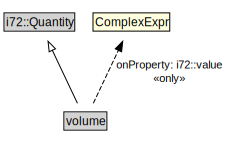

# volume

<a href="../../diagrams/CityUnits__volume.dot.svg">Open interactive volume diagram</a>

## Formalization for volume

| Property | Constraint |
|----------|------------|
| i72::value | all ComplexExpr |
| subClassOf | i72::Quantity |

