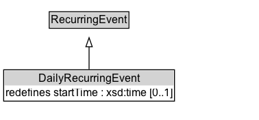

# DailyRecurringEvent

A DailyRecurringEvent is a RecurringEvent that occurs every day. It has a maximum of one associated time, the start time. Typically, a daily recurring event will occur at the same time every day, but it is also possible that no commitment is made to a recurring start time for the event, in which case no start time is specified. A DailyEvent does not necessarily have the same endtime or duration, therefore these are not specified.

## Diagram

=== "SVG (interactive)"

    <!-- Generated by graphviz version 14.1.3 (20260303.0454)
     -->
    <!-- Pages: 1 -->
    <svg width="284pt" height="132pt"
     viewBox="0.00 0.00 284.00 132.00" xmlns="http://www.w3.org/2000/svg" xmlns:xlink="http://www.w3.org/1999/xlink">
    <g id="graph0" class="graph" transform="scale(1 1) rotate(0) translate(4 128)">
    <polygon fill="white" stroke="none" points="-4,4 -4,-128 279.5,-128 279.5,4 -4,4"/>
    <g id="clust3" class="cluster">
    <title>cluster_associated</title>
    </g>
    <!-- RecurringEvent -->
    <g id="node1" class="node">
    <title>RecurringEvent</title>
    <g id="a_node1"><a xlink:href="../RecurringEvent" xlink:title="&lt;TABLE&gt;">
    <polygon fill="lightgray" stroke="none" points="50.88,-97.88 50.88,-114.12 136.12,-114.12 136.12,-97.88 50.88,-97.88"/>
    <text xml:space="preserve" text-anchor="start" x="51.88" y="-101.88" font-family="Arial" font-size="12.00">RecurringEvent</text>
    <polygon fill="none" stroke="black" points="49.88,-96.88 49.88,-115.12 137.12,-115.12 137.12,-96.88 49.88,-96.88"/>
    </a>
    </g>
    </g>
    <!-- DailyRecurringEvent -->
    <g id="node2" class="node">
    <title>DailyRecurringEvent</title>
    <g id="a_node2"><a xlink:href="../DailyRecurringEvent" xlink:title="&lt;TABLE&gt;">
    <polygon fill="lightgray" stroke="none" points="1,-34 1,-50.25 186,-50.25 186,-34 1,-34"/>
    <text xml:space="preserve" text-anchor="start" x="38" y="-38" font-family="Arial" font-size="12.00">DailyRecurringEvent</text>
    <text xml:space="preserve" text-anchor="start" x="2" y="-21.75" font-family="Arial" font-size="12.00">redefines startTime : xsd:time [0..1]</text>
    <polygon fill="none" stroke="black" points="0,-16.75 0,-51.25 187,-51.25 187,-16.75 0,-16.75"/>
    </a>
    </g>
    </g>
    <!-- DailyRecurringEvent&#45;&gt;RecurringEvent -->
    <g id="edge1" class="edge">
    <title>DailyRecurringEvent&#45;&gt;RecurringEvent</title>
    <path fill="none" stroke="black" d="M93.5,-51.79C93.5,-59.25 93.5,-68.24 93.5,-76.69"/>
    <polygon fill="none" stroke="black" points="90,-76.54 93.5,-86.54 97,-76.54 90,-76.54"/>
    </g>
    <!-- Invis -->
    </g>
    </svg>

=== "PNG"

    

## Formalization for DailyRecurringEvent

| Property | Constraint |
|----------|------------|
| [startTime](../properties/startTime.md) | max 1 |
| [startTime](../properties/startTime.md) | max 1 xsd:time |
| subClassOf | [RecurringEvent](RecurringEvent.md) |

