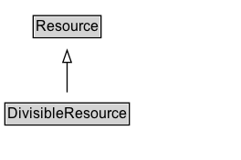

# DivisibleResource

A Resource that can be divided for use or consumption between multiple Activities.

## Diagram

=== "SVG (interactive)"

    <!-- Generated by graphviz version 14.1.3 (20260303.0454)
     -->
    <!-- Pages: 1 -->
    <svg width="198pt" height="132pt"
     viewBox="0.00 0.00 198.00 132.00" xmlns="http://www.w3.org/2000/svg" xmlns:xlink="http://www.w3.org/1999/xlink">
    <g id="graph0" class="graph" transform="scale(1 1) rotate(0) translate(4 128)">
    <polygon fill="white" stroke="none" points="-4,4 -4,-128 194.12,-128 194.12,4 -4,4"/>
    <g id="clust3" class="cluster">
    <title>cluster_associated</title>
    </g>
    <!-- Resource -->
    <g id="node1" class="node">
    <title>Resource</title>
    <g id="a_node1"><a xlink:href="../Resource" xlink:title="&lt;TABLE&gt;">
    <polygon fill="lightgray" stroke="none" points="24.25,-97.88 24.25,-114.12 78,-114.12 78,-97.88 24.25,-97.88"/>
    <text xml:space="preserve" text-anchor="start" x="25.25" y="-101.88" font-family="Arial" font-size="12.00">Resource</text>
    <polygon fill="none" stroke="black" points="23.25,-96.88 23.25,-115.12 79,-115.12 79,-96.88 23.25,-96.88"/>
    </a>
    </g>
    </g>
    <!-- DivisibleResource -->
    <g id="node2" class="node">
    <title>DivisibleResource</title>
    <g id="a_node2"><a xlink:href="../DivisibleResource" xlink:title="&lt;TABLE&gt;">
    <polygon fill="lightgray" stroke="none" points="1,-25.88 1,-42.12 101.25,-42.12 101.25,-25.88 1,-25.88"/>
    <text xml:space="preserve" text-anchor="start" x="2" y="-29.88" font-family="Arial" font-size="12.00">DivisibleResource</text>
    <polygon fill="none" stroke="black" points="0,-24.88 0,-43.12 102.25,-43.12 102.25,-24.88 0,-24.88"/>
    </a>
    </g>
    </g>
    <!-- DivisibleResource&#45;&gt;Resource -->
    <g id="edge1" class="edge">
    <title>DivisibleResource&#45;&gt;Resource</title>
    <path fill="none" stroke="black" d="M51.12,-51.79C51.12,-59.25 51.12,-68.24 51.12,-76.69"/>
    <polygon fill="none" stroke="black" points="47.63,-76.54 51.13,-86.54 54.63,-76.54 47.63,-76.54"/>
    </g>
    <!-- Invis -->
    </g>
    </svg>

=== "PNG"

    

## Formalization for DivisibleResource

| Property | Constraint |
|----------|------------|
| subClassOf | [Resource](Resource.md) |

