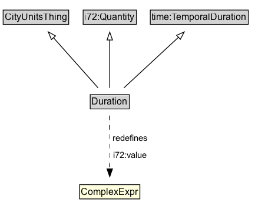

# Duration

Duration is the amount of time that elapses between two instants or events.

## Diagram

=== "SVG (interactive)"

    <!-- Generated by graphviz version 14.1.3 (20260303.0454)
     -->
    <!-- Pages: 1 -->
    <svg width="354pt" height="267pt"
     viewBox="0.00 0.00 354.00 267.00" xmlns="http://www.w3.org/2000/svg" xmlns:xlink="http://www.w3.org/1999/xlink">
    <g id="graph0" class="graph" transform="scale(1 1) rotate(0) translate(4 263)">
    <polygon fill="white" stroke="none" points="-4,4 -4,-263 349.75,-263 349.75,4 -4,4"/>
    <g id="clust3" class="cluster">
    <title>cluster_associated</title>
    </g>
    <!-- CityUnitsThing -->
    <g id="node1" class="node">
    <title>CityUnitsThing</title>
    <g id="a_node1"><a xlink:href="../CityUnitsThing" xlink:title="&lt;TABLE&gt;">
    <polygon fill="lightgray" stroke="none" points="1,-232.88 1,-249.12 82.5,-249.12 82.5,-232.88 1,-232.88"/>
    <text xml:space="preserve" text-anchor="start" x="2" y="-236.88" font-family="Arial" font-size="12.00">CityUnitsThing</text>
    <polygon fill="none" stroke="black" points="0,-231.88 0,-250.12 83.5,-250.12 83.5,-231.88 0,-231.88"/>
    </a>
    </g>
    </g>
    <!-- i72_Quantity -->
    <g id="node2" class="node">
    <title>i72_Quantity</title>
    <g id="a_node2"><a xlink:href="https://w3id.org/citydata/21972/v1/Quantity" xlink:title="&lt;TABLE&gt;">
    <polygon fill="lightgray" stroke="none" points="102.88,-232.88 102.88,-249.12 168.62,-249.12 168.62,-232.88 102.88,-232.88"/>
    <text xml:space="preserve" text-anchor="start" x="103.88" y="-236.88" font-family="Arial" font-size="12.00">i72:Quantity</text>
    <polygon fill="none" stroke="black" points="101.88,-231.88 101.88,-250.12 169.62,-250.12 169.62,-231.88 101.88,-231.88"/>
    </a>
    </g>
    </g>
    <!-- time_TemporalDuration -->
    <g id="node3" class="node">
    <title>time_TemporalDuration</title>
    <g id="a_node3"><a xlink:href="https://w3id.org/citydata/imported/time/latest/TemporalDuration" xlink:title="&lt;TABLE&gt;">
    <polygon fill="lightgray" stroke="none" points="188.38,-232.88 188.38,-249.12 311.12,-249.12 311.12,-232.88 188.38,-232.88"/>
    <text xml:space="preserve" text-anchor="start" x="189.38" y="-236.88" font-family="Arial" font-size="12.00">time:TemporalDuration</text>
    <polygon fill="none" stroke="black" points="187.38,-231.88 187.38,-250.12 312.12,-250.12 312.12,-231.88 187.38,-231.88"/>
    </a>
    </g>
    </g>
    <!-- Duration -->
    <g id="node4" class="node">
    <title>Duration</title>
    <g id="a_node4"><a xlink:href="../Duration" xlink:title="&lt;TABLE&gt;">
    <polygon fill="lightgray" stroke="none" points="111.88,-124.88 111.88,-141.12 159.62,-141.12 159.62,-124.88 111.88,-124.88"/>
    <text xml:space="preserve" text-anchor="start" x="112.88" y="-128.88" font-family="Arial" font-size="12.00">Duration</text>
    <polygon fill="none" stroke="black" points="110.88,-123.88 110.88,-142.12 160.62,-142.12 160.62,-123.88 110.88,-123.88"/>
    </a>
    </g>
    </g>
    <!-- Duration&#45;&gt;CityUnitsThing -->
    <g id="edge1" class="edge">
    <title>Duration&#45;&gt;CityUnitsThing</title>
    <path fill="none" stroke="black" d="M120.86,-150.8C105.55,-168.05 81.55,-195.12 64,-214.92"/>
    <polygon fill="none" stroke="black" points="61.46,-212.5 57.44,-222.31 66.7,-217.15 61.46,-212.5"/>
    </g>
    <!-- Duration&#45;&gt;i72_Quantity -->
    <g id="edge2" class="edge">
    <title>Duration&#45;&gt;i72_Quantity</title>
    <path fill="none" stroke="black" d="M135.75,-150.8C135.75,-167.28 135.75,-192.7 135.75,-212.2"/>
    <polygon fill="none" stroke="black" points="132.25,-211.92 135.75,-221.92 139.25,-211.92 132.25,-211.92"/>
    </g>
    <!-- Duration&#45;&gt;time_TemporalDuration -->
    <g id="edge3" class="edge">
    <title>Duration&#45;&gt;time_TemporalDuration</title>
    <path fill="none" stroke="black" d="M153.73,-150.72C172.46,-168.13 202,-195.6 223.37,-215.47"/>
    <polygon fill="none" stroke="black" points="220.87,-217.93 230.58,-222.17 225.64,-212.8 220.87,-217.93"/>
    </g>
    <!-- na010c749982e452794368b522251db07b15 -->
    <g id="node6" class="node">
    <title>na010c749982e452794368b522251db07b15</title>
    <polygon fill="lightyellow" stroke="none" points="97.38,-8.88 97.38,-27.12 174.12,-27.12 174.12,-8.88 97.38,-8.88"/>
    <text xml:space="preserve" text-anchor="start" x="99.38" y="-13.88" font-family="Arial" font-size="12.00">ComplexExpr</text>
    <polygon fill="none" stroke="black" points="97.38,-8.88 97.38,-27.12 174.12,-27.12 174.12,-8.88 97.38,-8.88"/>
    </g>
    <!-- Duration&#45;&gt;na010c749982e452794368b522251db07b15 -->
    <g id="edge4" class="edge">
    <title>Duration&#45;&gt;na010c749982e452794368b522251db07b15</title>
    <path fill="none" stroke="black" stroke-dasharray="5,2" d="M135.75,-115.33C135.75,-97.38 135.75,-68.54 135.75,-47.08"/>
    <polygon fill="black" stroke="black" points="139.25,-47.26 135.75,-37.26 132.25,-47.26 139.25,-47.26"/>
    <polygon fill="white" stroke="none" points="135.75,-54 135.75,-97 188,-97 188,-54 135.75,-54"/>
    <text xml:space="preserve" text-anchor="start" x="139.75" y="-82.5" font-family="Arial" font-size="11.00">redefines</text>
    <text xml:space="preserve" text-anchor="start" x="140.5" y="-61" font-family="Arial" font-size="11.00">i72:value</text>
    </g>
    <!-- Invis -->
    </g>
    </svg>

=== "PNG"

    

## Formalization for Duration

| Property | Constraint |
|----------|------------|
| subClassOf | [time:TemporalDuration](time:TemporalDuration.md) |
| subClassOf | [i72:Quantity](i72:Quantity.md) |
| subClassOf | [CityUnitsThing](CityUnitsThing.md) |

