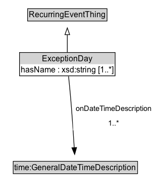

# ExceptionDay

An ExceptionDay specifies a day or days that recursExcept and recursAddition use to specify unique days that do not recur on the same day each year, for example, holidays. 

## Diagram

=== "SVG (interactive)"

    <!-- Generated by graphviz version 14.1.3 (20260303.0454)
     -->
    <!-- Pages: 1 -->
    <svg width="233pt" height="286pt"
     viewBox="0.00 0.00 233.00 286.00" xmlns="http://www.w3.org/2000/svg" xmlns:xlink="http://www.w3.org/1999/xlink">
    <g id="graph0" class="graph" transform="scale(1 1) rotate(0) translate(4 282)">
    <polygon fill="white" stroke="none" points="-4,4 -4,-282 229.02,-282 229.02,4 -4,4"/>
    <g id="clust3" class="cluster">
    <title>cluster_associated</title>
    </g>
    <!-- RecurringEventThing -->
    <g id="node1" class="node">
    <title>RecurringEventThing</title>
    <g id="a_node1"><a xlink:href="../RecurringEventThing" xlink:title="&lt;TABLE&gt;">
    <polygon fill="lightgray" stroke="none" points="38,-251.88 38,-268.12 154,-268.12 154,-251.88 38,-251.88"/>
    <text xml:space="preserve" text-anchor="start" x="39" y="-255.88" font-family="Arial" font-size="12.00">RecurringEventThing</text>
    <polygon fill="none" stroke="black" points="37,-250.88 37,-269.12 155,-269.12 155,-250.88 37,-250.88"/>
    </a>
    </g>
    </g>
    <!-- ExceptionDay -->
    <g id="node2" class="node">
    <title>ExceptionDay</title>
    <g id="a_node2"><a xlink:href="../ExceptionDay" xlink:title="&lt;TABLE&gt;">
    <polygon fill="lightgray" stroke="none" points="26,-187 26,-203.25 166,-203.25 166,-187 26,-187"/>
    <text xml:space="preserve" text-anchor="start" x="58.5" y="-191" font-family="Arial" font-size="12.00">ExceptionDay</text>
    <text xml:space="preserve" text-anchor="start" x="27" y="-174.75" font-family="Arial" font-size="12.00">hasName : xsd:string [1..&#42;]</text>
    <polygon fill="none" stroke="black" points="25,-169.75 25,-204.25 167,-204.25 167,-169.75 25,-169.75"/>
    </a>
    </g>
    </g>
    <!-- ExceptionDay&#45;&gt;RecurringEventThing -->
    <g id="edge1" class="edge">
    <title>ExceptionDay&#45;&gt;RecurringEventThing</title>
    <path fill="none" stroke="black" d="M96,-204.71C96,-212.47 96,-221.92 96,-230.74"/>
    <polygon fill="none" stroke="black" points="92.5,-230.66 96,-240.66 99.5,-230.66 92.5,-230.66"/>
    </g>
    <!-- Invis -->
    <!-- ExceptionDay&#45;&gt;Invis -->
    <!-- time_GeneralDateTimeDescription -->
    <g id="node4" class="node">
    <title>time_GeneralDateTimeDescription</title>
    <g id="a_node4"><a xlink:href="https://w3id.org/citydata/imported/time/latest/GeneralDateTimeDescription" xlink:title="&lt;TABLE&gt;">
    <polygon fill="lightgray" stroke="none" points="16.62,-25.88 16.62,-42.12 199.38,-42.12 199.38,-25.88 16.62,-25.88"/>
    <text xml:space="preserve" text-anchor="start" x="17.62" y="-29.88" font-family="Arial" font-size="12.00">time:GeneralDateTimeDescription</text>
    <polygon fill="none" stroke="black" points="15.62,-24.88 15.62,-43.12 200.38,-43.12 200.38,-24.88 15.62,-24.88"/>
    </a>
    </g>
    </g>
    <!-- ExceptionDay&#45;&gt;time_GeneralDateTimeDescription -->
    <g id="edge4" class="edge">
    <title>ExceptionDay&#45;&gt;time_GeneralDateTimeDescription</title>
    <path fill="none" stroke="black" d="M97.85,-169.06C98.85,-159.5 100.08,-147.34 101,-136.5 103.1,-111.75 105.01,-83.57 106.3,-63.19"/>
    <polygon fill="black" stroke="black" points="109.78,-63.6 106.91,-53.41 102.79,-63.17 109.78,-63.6"/>
    <polygon fill="white" stroke="none" points="104.52,-89 104.52,-132 225.02,-132 225.02,-89 104.52,-89"/>
    <text xml:space="preserve" text-anchor="start" x="108.52" y="-117.5" font-family="Arial" font-size="11.00">onDateTimeDescription</text>
    <text xml:space="preserve" text-anchor="start" x="156.52" y="-96" font-family="Arial" font-size="11.00">1..&#42;</text>
    </g>
    <!-- Invis&#45;&gt;time_GeneralDateTimeDescription -->
    </g>
    </svg>

=== "PNG"

    

## Formalization for ExceptionDay

| Property | Constraint |
|----------|------------|
| [hasName](../properties/hasName.md) | min 1 |
| [hasName](../properties/hasName.md) | min 1 xsd:string |
| [onDateTimeDescription](../properties/onDateTimeDescription.md) | min 1 |
| [onDateTimeDescription](../properties/onDateTimeDescription.md) | min 1 [time:GeneralDateTimeDescription](http://www.w3.org/2006/time#GeneralDateTimeDescription) |
| subClassOf | [RecurringEventThing](RecurringEventThing.md) |

