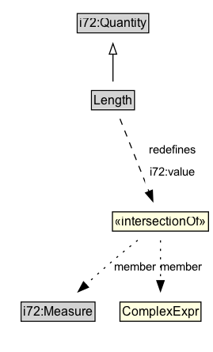

# Length

Length is the amount of space between two geographical points along a curve. It is a base quantity in the International System of Units and other systems of units. Length is speed times time. The metre, a base unit of length in the International System of Units, is defined in terms of speed of light during a certain time interval.

## Diagram

=== "SVG (interactive)"

    <!-- Generated by graphviz version 14.1.3 (20260303.0454)
     -->
    <!-- Pages: 1 -->
    <svg width="202pt" height="334pt"
     viewBox="0.00 0.00 202.00 334.00" xmlns="http://www.w3.org/2000/svg" xmlns:xlink="http://www.w3.org/1999/xlink">
    <g id="graph0" class="graph" transform="scale(1 1) rotate(0) translate(4 329.5)">
    <polygon fill="white" stroke="none" points="-4,4 -4,-329.5 197.5,-329.5 197.5,4 -4,4"/>
    <g id="clust3" class="cluster">
    <title>cluster_associated</title>
    </g>
    <!-- i72_Quantity -->
    <g id="node1" class="node">
    <title>i72_Quantity</title>
    <g id="a_node1"><a xlink:href="https://w3id.org/citydata/21972/v1/Quantity" xlink:title="&lt;TABLE&gt;">
    <polygon fill="lightgray" stroke="none" points="70.12,-299.38 70.12,-315.62 135.88,-315.62 135.88,-299.38 70.12,-299.38"/>
    <text xml:space="preserve" text-anchor="start" x="71.12" y="-303.38" font-family="Arial" font-size="12.00">i72:Quantity</text>
    <polygon fill="none" stroke="black" points="69.12,-298.38 69.12,-316.62 136.88,-316.62 136.88,-298.38 69.12,-298.38"/>
    </a>
    </g>
    </g>
    <!-- Length -->
    <g id="node2" class="node">
    <title>Length</title>
    <g id="a_node2"><a xlink:href="../Length" xlink:title="&lt;TABLE&gt;">
    <polygon fill="lightgray" stroke="none" points="83.62,-226.38 83.62,-242.62 122.38,-242.62 122.38,-226.38 83.62,-226.38"/>
    <text xml:space="preserve" text-anchor="start" x="84.62" y="-230.38" font-family="Arial" font-size="12.00">Length</text>
    <polygon fill="none" stroke="black" points="82.62,-225.38 82.62,-243.62 123.38,-243.62 123.38,-225.38 82.62,-225.38"/>
    </a>
    </g>
    </g>
    <!-- Length&#45;&gt;i72_Quantity -->
    <g id="edge1" class="edge">
    <title>Length&#45;&gt;i72_Quantity</title>
    <path fill="none" stroke="black" d="M103,-252.21C103,-259.97 103,-269.42 103,-278.24"/>
    <polygon fill="none" stroke="black" points="99.5,-278.16 103,-288.16 106.5,-278.16 99.5,-278.16"/>
    </g>
    <!-- Invis -->
    <!-- Length&#45;&gt;Invis -->
    <!-- ncbd96c33227149b1a64e837a10238d87b17 -->
    <g id="node5" class="node">
    <title>ncbd96c33227149b1a64e837a10238d87b17</title>
    <polygon fill="lightyellow" stroke="none" points="102.5,-110.38 102.5,-128.62 193.5,-128.62 193.5,-110.38 102.5,-110.38"/>
    <text xml:space="preserve" text-anchor="start" x="104.5" y="-115.38" font-family="Arial" font-size="12.00">«intersectionOf»</text>
    <polygon fill="none" stroke="black" points="102.5,-110.38 102.5,-128.62 193.5,-128.62 193.5,-110.38 102.5,-110.38"/>
    </g>
    <!-- Length&#45;&gt;ncbd96c33227149b1a64e837a10238d87b17 -->
    <g id="edge6" class="edge">
    <title>Length&#45;&gt;ncbd96c33227149b1a64e837a10238d87b17</title>
    <path fill="none" stroke="black" stroke-dasharray="5,2" d="M109.64,-216.83C116.88,-198.63 128.59,-169.23 137.17,-147.69"/>
    <polygon fill="black" stroke="black" points="140.32,-149.23 140.77,-138.65 133.82,-146.64 140.32,-149.23"/>
    <polygon fill="white" stroke="none" points="133.44,-155.5 133.44,-198.5 185.69,-198.5 185.69,-155.5 133.44,-155.5"/>
    <text xml:space="preserve" text-anchor="start" x="137.44" y="-184" font-family="Arial" font-size="11.00">redefines</text>
    <text xml:space="preserve" text-anchor="start" x="138.19" y="-162.5" font-family="Arial" font-size="11.00">i72:value</text>
    </g>
    <!-- i72_Measure -->
    <g id="node4" class="node">
    <title>i72_Measure</title>
    <g id="a_node4"><a xlink:href="https://w3id.org/citydata/21972/v1/Measure" xlink:title="&lt;TABLE&gt;">
    <polygon fill="lightgray" stroke="none" points="17,-25.88 17,-42.12 85,-42.12 85,-25.88 17,-25.88"/>
    <text xml:space="preserve" text-anchor="start" x="18" y="-29.88" font-family="Arial" font-size="12.00">i72:Measure</text>
    <polygon fill="none" stroke="black" points="16,-24.88 16,-43.12 86,-43.12 86,-24.88 16,-24.88"/>
    </a>
    </g>
    </g>
    <!-- Invis&#45;&gt;i72_Measure -->
    <!-- ncbd96c33227149b1a64e837a10238d87b17&#45;&gt;i72_Measure -->
    <g id="edge4" class="edge">
    <title>ncbd96c33227149b1a64e837a10238d87b17&#45;&gt;i72_Measure</title>
    <path fill="none" stroke="black" stroke-dasharray="1,5" d="M126.41,-101.68C119.28,-96 111.35,-89.56 104.25,-83.5 95.36,-75.91 85.86,-67.39 77.38,-59.64"/>
    <polygon fill="black" stroke="black" points="79.82,-57.13 70.09,-52.93 75.08,-62.28 79.82,-57.13"/>
    <text xml:space="preserve" text-anchor="middle" x="124.12" y="-73.05" font-family="Arial" font-size="11.00">member</text>
    </g>
    <!-- ncbd96c33227149b1a64e837a10238d87b18 -->
    <g id="node6" class="node">
    <title>ncbd96c33227149b1a64e837a10238d87b18</title>
    <polygon fill="lightyellow" stroke="none" points="109.62,-24.88 109.62,-43.12 186.38,-43.12 186.38,-24.88 109.62,-24.88"/>
    <text xml:space="preserve" text-anchor="start" x="111.62" y="-29.88" font-family="Arial" font-size="12.00">ComplexExpr</text>
    <polygon fill="none" stroke="black" points="109.62,-24.88 109.62,-43.12 186.38,-43.12 186.38,-24.88 109.62,-24.88"/>
    </g>
    <!-- ncbd96c33227149b1a64e837a10238d87b17&#45;&gt;ncbd96c33227149b1a64e837a10238d87b18 -->
    <g id="edge5" class="edge">
    <title>ncbd96c33227149b1a64e837a10238d87b17&#45;&gt;ncbd96c33227149b1a64e837a10238d87b18</title>
    <path fill="none" stroke="black" stroke-dasharray="1,5" d="M148,-101.6C148,-90.62 148,-76.04 148,-63.32"/>
    <polygon fill="black" stroke="black" points="151.5,-63.39 148,-53.39 144.5,-63.39 151.5,-63.39"/>
    <text xml:space="preserve" text-anchor="middle" x="167.88" y="-73.05" font-family="Arial" font-size="11.00">member</text>
    </g>
    </g>
    </svg>

=== "PNG"

    

## Formalization for Length

| Property | Constraint |
|----------|------------|
| subClassOf | [i72:Quantity](i72:Quantity.md) |

