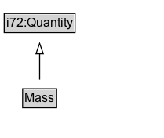

# Mass

## Diagram

=== "SVG (interactive)"

    <!-- Generated by graphviz version 14.1.3 (20260303.0454)
     -->
    <!-- Pages: 1 -->
    <svg width="157pt" height="132pt"
     viewBox="0.00 0.00 157.00 132.00" xmlns="http://www.w3.org/2000/svg" xmlns:xlink="http://www.w3.org/1999/xlink">
    <g id="graph0" class="graph" transform="scale(1 1) rotate(0) translate(4 128)">
    <polygon fill="white" stroke="none" points="-4,4 -4,-128 152.88,-128 152.88,4 -4,4"/>
    <g id="clust3" class="cluster">
    <title>cluster_associated</title>
    </g>
    <!-- i72_Quantity -->
    <g id="node1" class="node">
    <title>i72_Quantity</title>
    <g id="a_node1"><a xlink:href="https://w3id.org/citydata/21972/v1/Quantity" xlink:title="&lt;TABLE&gt;">
    <polygon fill="lightgray" stroke="none" points="1,-97.88 1,-114.12 66.75,-114.12 66.75,-97.88 1,-97.88"/>
    <text xml:space="preserve" text-anchor="start" x="2" y="-101.88" font-family="Arial" font-size="12.00">i72:Quantity</text>
    <polygon fill="none" stroke="black" points="0,-96.88 0,-115.12 67.75,-115.12 67.75,-96.88 0,-96.88"/>
    </a>
    </g>
    </g>
    <!-- Mass -->
    <g id="node2" class="node">
    <title>Mass</title>
    <g id="a_node2"><a xlink:href="../Mass" xlink:title="&lt;TABLE&gt;">
    <polygon fill="lightgray" stroke="none" points="18.62,-25.88 18.62,-42.12 49.12,-42.12 49.12,-25.88 18.62,-25.88"/>
    <text xml:space="preserve" text-anchor="start" x="19.62" y="-29.88" font-family="Arial" font-size="12.00">Mass</text>
    <polygon fill="none" stroke="black" points="17.62,-24.88 17.62,-43.12 50.12,-43.12 50.12,-24.88 17.62,-24.88"/>
    </a>
    </g>
    </g>
    <!-- Mass&#45;&gt;i72_Quantity -->
    <g id="edge1" class="edge">
    <title>Mass&#45;&gt;i72_Quantity</title>
    <path fill="none" stroke="black" d="M33.88,-51.79C33.88,-59.25 33.88,-68.24 33.88,-76.69"/>
    <polygon fill="none" stroke="black" points="30.38,-76.54 33.88,-86.54 37.38,-76.54 30.38,-76.54"/>
    </g>
    <!-- Invis -->
    </g>
    </svg>

=== "PNG"

    

## Formalization for Mass

| Property | Constraint |
|----------|------------|
| [i72:value](https://w3id.org/citydata/21972/v1/value) | only ComplexExpr |
| subClassOf | [i72:Quantity](https://w3id.org/citydata/21972/v1/Quantity) |

