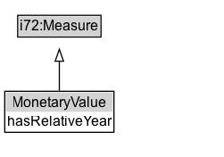

# MonetaryValue

A Monetary Value has a numerical value that is relative to a particular date (year). A Monetary Value is measured with some currency.

## Diagram

=== "SVG (interactive)"

    <!-- Generated by graphviz version 14.1.3 (20260303.0454)
     -->
    <!-- Pages: 1 -->
    <svg width="188pt" height="132pt"
     viewBox="0.00 0.00 188.00 132.00" xmlns="http://www.w3.org/2000/svg" xmlns:xlink="http://www.w3.org/1999/xlink">
    <g id="graph0" class="graph" transform="scale(1 1) rotate(0) translate(4 128)">
    <polygon fill="white" stroke="none" points="-4,4 -4,-128 183.88,-128 183.88,4 -4,4"/>
    <g id="clust3" class="cluster">
    <title>cluster_associated</title>
    </g>
    <!-- i72_Measure -->
    <g id="node1" class="node">
    <title>i72_Measure</title>
    <g id="a_node1"><a xlink:href="https://w3id.org/citydata/21972/v1/Measure" xlink:title="&lt;TABLE&gt;">
    <polygon fill="lightgray" stroke="none" points="11.88,-97.88 11.88,-114.12 79.88,-114.12 79.88,-97.88 11.88,-97.88"/>
    <text xml:space="preserve" text-anchor="start" x="12.88" y="-101.88" font-family="Arial" font-size="12.00">i72:Measure</text>
    <polygon fill="none" stroke="black" points="10.88,-96.88 10.88,-115.12 80.88,-115.12 80.88,-96.88 10.88,-96.88"/>
    </a>
    </g>
    </g>
    <!-- MonetaryValue -->
    <g id="node2" class="node">
    <title>MonetaryValue</title>
    <g id="a_node2"><a xlink:href="../MonetaryValue" xlink:title="&lt;TABLE&gt;">
    <polygon fill="lightgray" stroke="none" points="1,-34 1,-50.25 90.75,-50.25 90.75,-34 1,-34"/>
    <text xml:space="preserve" text-anchor="start" x="6.12" y="-38" font-family="Arial" font-size="12.00">MonetaryValue</text>
    <text xml:space="preserve" text-anchor="start" x="2" y="-21.75" font-family="Arial" font-size="12.00">hasRelativeYear</text>
    <polygon fill="none" stroke="black" points="0,-16.75 0,-51.25 91.75,-51.25 91.75,-16.75 0,-16.75"/>
    </a>
    </g>
    </g>
    <!-- MonetaryValue&#45;&gt;i72_Measure -->
    <g id="edge1" class="edge">
    <title>MonetaryValue&#45;&gt;i72_Measure</title>
    <path fill="none" stroke="black" d="M45.88,-51.79C45.88,-59.25 45.88,-68.24 45.88,-76.69"/>
    <polygon fill="none" stroke="black" points="42.38,-76.54 45.88,-86.54 49.38,-76.54 42.38,-76.54"/>
    </g>
    <!-- Invis -->
    </g>
    </svg>

=== "PNG"

    

## Formalization for MonetaryValue

| Property | Constraint |
|----------|------------|
| [hasRelativeYear](../properties/hasRelativeYear.md) | exactly 1 |
| [i72:unit_of_measure](https://w3id.org/citydata/21972/v1/unit_of_measure) | only [i72:Monetary_unit](https://w3id.org/citydata/21972/v1/Monetary_unit) |
| subClassOf | [i72:Measure](https://w3id.org/citydata/21972/v1/Measure) |

## Used by classes

| Class | Property |
|-------|----------|
| [Value Of Money (i72)](ValueOfMoney.md) | [i72:value](https://w3id.org/citydata/21972/v1/value) |

