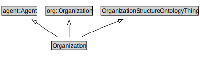

# Organization

<a href="../../diagrams/OrganizationStructure__Organization.dot.svg">Open interactive Organization diagram</a>

## Formalization for Organization

| Property | Constraint |
|----------|------------|
| subClassOf | agent::Agent |
| subClassOf | OrganizationStructureOntologyThing |
| subClassOf | org::Organization |

